<!-- Required extensions: pymdownx.betterem, pymdownx.tilde, pymdownx.emoji, pymdownx.tasklist, pymdownx.superfences -->

# Takeoff Dataiku Plugin

See a video demo of the plugin in action
[here](https://www.loom.com/share/9c24d2ed5ce94165b76834a068fafd66?sid=de7762cc-229e-4aa8-ad54-28476cb009ab)


## Building

A makefile is provided to build the plugin. This requires you have [ant](https://docs.jboss.org/jbossas/docs/Getting_Started_Guide/beta422/html/About_the_Example_Applications-Install_Ant.html) installed and on your `PATH`, and have your DSS install directory as the environment variable `DKUINSTALLDIR`.

## Example: using the Dataiku Takeoff plugin to describe images

In this example, we'll setup a simple workflow to demonstrate using takeoff
with dataiku to do some simple AI tasks. First we'll use an image-to-text model to describe some images - each of which contains a saying. We'll then use a text generation model to explain the sayings, and then use an embedding model to embed the sayings. Finally, we'll use a RAG workflow to select which of the embedded texts is being described by the explanation. You can also import a copy of the demo DSS project, available from `docs/demo.zip`.


## Importing a dataset

First, we'll need a dataset. Here's one ChatGPT made earlier:

```csv
text,imageUrl
"An apple a day keeps the doctor away, forever and ever", "https://image-examples-llava.s3.amazonaws.com/images/apple_day.png"
"Every cloud has a silver lining in the sky of hope", "https://image-examples-llava.s3.amazonaws.com/images/cloud_silver.png"
"The quick brown fox jumps over the lazy dog", "https://image-examples-llava.s3.amazonaws.com/images/fox_dog.png"
"A stitch in time saves nine in the world of design", "https://image-examples-llava.s3.amazonaws.com/images/needle_thread.png"
"Slow and steady wins the race in the marathon of life", "https://image-examples-llava.s3.amazonaws.com/images/slow_steady.png"
"Time flies like an arrow; fruit flies like a banana", "https://image-examples-llava.s3.amazonaws.com/images/time_banana.png"
```

Save it in a file called `data.csv`. Then, after creating a blank project in DSS, import it from the dropdown menu.

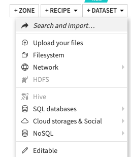

## Setting up Takeoff

Before we setup the dataiku plugin, we need
to setup the TitanML takeoff server to serve models and respond to requests.
We're going to use the
Takeoff [config](https://docs.titanml.co/docs/Docs/model_management/manifests)
file setup to deploy multiple
models at the same time, so we can explore all of the plugin's capabilities
at once.

Save the following as `config.yaml` in your working directory.

```yaml
takeoff:
  server_config:
    max_batch_size: 30
    batch_duration_millis: 50
    echo: false
    port: 3000
    enable_metrics: true
    heartbeat_check_interval: 5
    launch_management_server: true
    management_port: 3001
    vertex_port: 3002
    openai_port: 3003
  readers_config:
    reader1:
      model_name: TitanML/llava-1.5-13b-hf-awq
      device: cuda
      consumer_group: image-generator
      max_seq_length: 512
      cuda_visible_devices: 0
      max_batch_size: 4
    reader2:
      model_name: TheBloke/Llama-2-7B-Chat-AWQ
      device: cuda
      max_seq_length: 512
      consumer_group: generator
      cuda_visible_devices: 1
      max_batch_size: 4
    reader3:
      model_name: "BAAI/bge-small-en"
      device: cuda
      cuda_visible_devices: 0
      consumer_group: embedder 
```
This config sets up three models across two gpus (CUDA devices 0 and 1) to obtain the 24GB total of VRAM needed to run these models. If you receive
errors about going Out of Memory (OOM) or can't access a machine with enough GPUs/VRAM then consider trying smaller models, or try deploying
the individual models one-by-one. For more information, see
[supported models](https://docs.titanml.co/docs/Docs/launching/supported_models).
For more information on using AWS to spin up instances with a sufficient number of GPUs and VRAM,
see [here](https://docs.titanml.co/docs/Docs/integrations/aws). 

Then, after setting up your login for takeoff (described in detail
[here](https://docs.titanml.co/docs/Docs/launching/accessing_takeoff)),
run the following command to set your takeoff server running.

```bash
docker run --gpus all \
    -p 3000:3000 \
    -p 3001:3001 \
    -v ~/.takeoff_cache:/code/models \
    -v $PWD/config.yaml:/code/config.yaml \
    tytn/takeoff-pro:0.13.2-gpu
```

That container should boot up, running all three models in tandem.

## Using the plugin in a Dataiku workflow


> [!NOTE]
You'll need >= v12.5.2 of DSS to use the Takeoff plugin. Note that the default linux install is for V11 instead.

After you've installed the plugin (See [Installing the plugin into Dataiku](#installing-the-plugin-into-dataiku)
if you're installing it as a developer), you'll need to have the administrator enable
the LLM that the plugin provides. To do this as an administrator, go to the
`Administrator` page in the dropdown on the top right, and then go to the
connections page. Then add a `Custom LLM` connection.


In the configuration
page, make sure to set the endpoint URL for the deployed takeoff instance,
and to choose your plugin as the type. 

The dataiku platform treats each model deployed in the Takeoff server as a
model within the Custom LLM connection -  one for the embedding model, one for the
generation model, and one for the image generation model. The different
models are identified inside takeoff by
their [consumer_group](https://docs.titanml.co/docs/Docs/model_management/readers):
internally,
takeoff will route all requests with a given `consumer_group` to the
model that was deployed with that key. As such, connecting Takeoff with DSS is as simple as providing
the endpoint on which Takeoff is hosted 
(`http://localhost:3000` if you've been following these instructions), 
and the consumer group of the specific model type. For image-to-text, select `Chat Completion` as the capability.


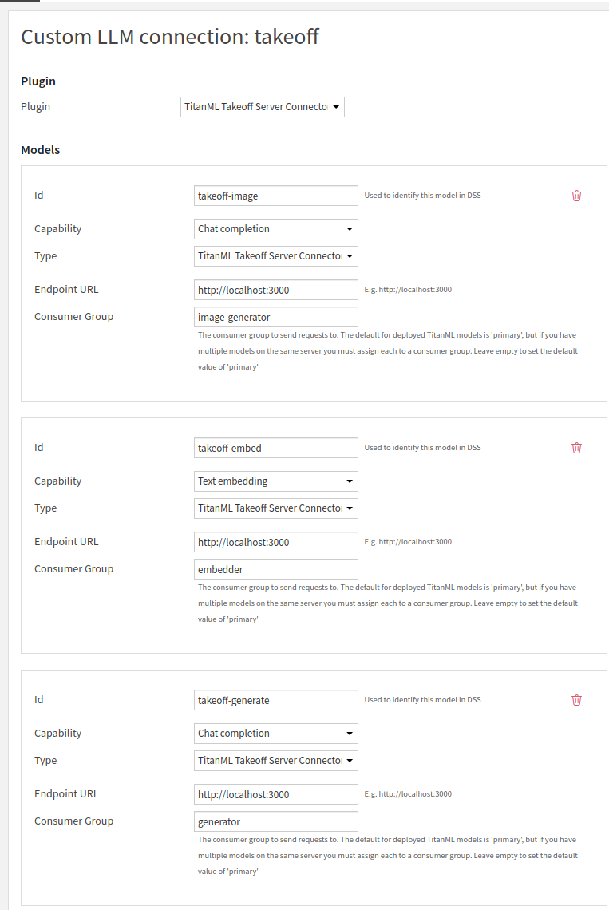

Once you've finished this section - you should have setup 3 dataiku models within a single connection, for
use inside your Dataiku flows. On the takeoff side, you've deployed these
three language models on the same machine, such that dataiku can address
them all individually.

## Using these LLMs in a workflow: Image to Text

Coming back to our dataset: we're going to build 3 LLM workflows that
transform that dataset. First, image to text:

To transform the images in our dataset using the takeoff connection, start
by adding a new LLM 'Prompt' Recipe. This can be found in the sidebar:
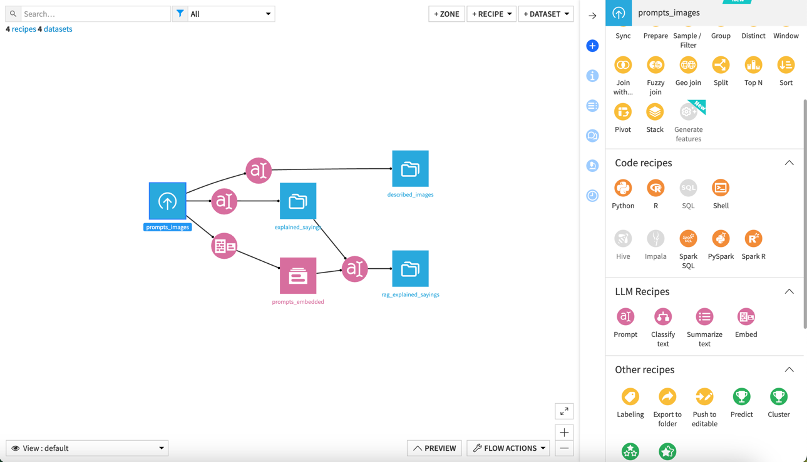
This icon:


Inside the setup, choose the image generation LLM from the dropdown, and
then choose the "Advanced Prompt" option. Add an image tag to the start of
the prompt: the image tag should be formatted as `<image:{{imageUrl}}>`,
where `{{imageUrl}}` is a placeholder for the actual URL pointing to the
image. The rest of the prompt is a description of the task you'd like the
model to perform, including any extra system prompt information you'd like
to feed to the model.

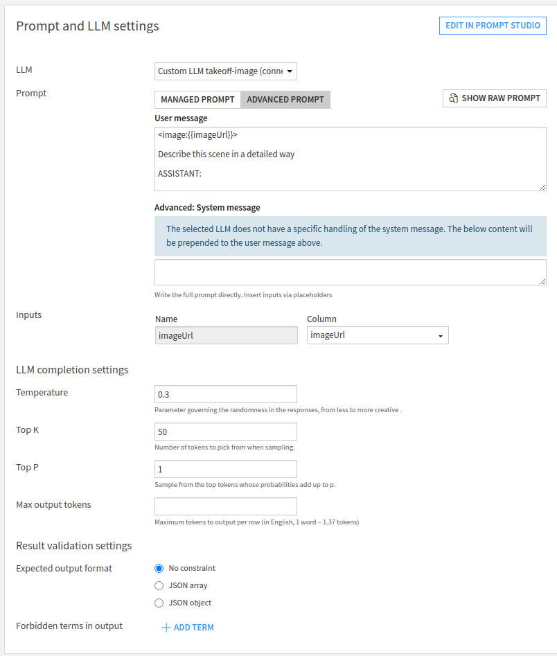


> [!NOTE]
Image to text is supported only for remote urls (in dataiku) for the moment. A
text field in your input should contain a URL pointing to an image to which your takeoff
instance has access - for example: `https://fastly.picsum.photos/id/622/200/300.jpg?hmac=HR8-4uUEihkyJx4VczHLFhVvELy7KCD1jm16BABaDy8`


Click the run button on the LLM connection you've just built. It should
begin to create image descriptions of each of the images in your dataset.
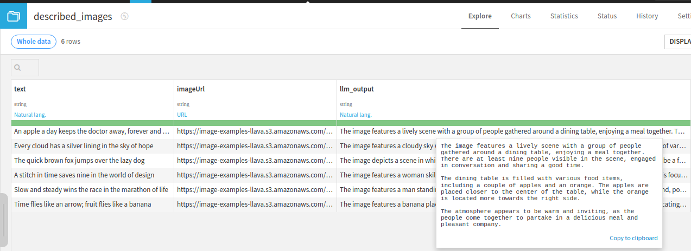


## Using these LLMs in a workflow: Generating text
Next we'll generate summaries of the sayings in the dataset, using the generative model. 
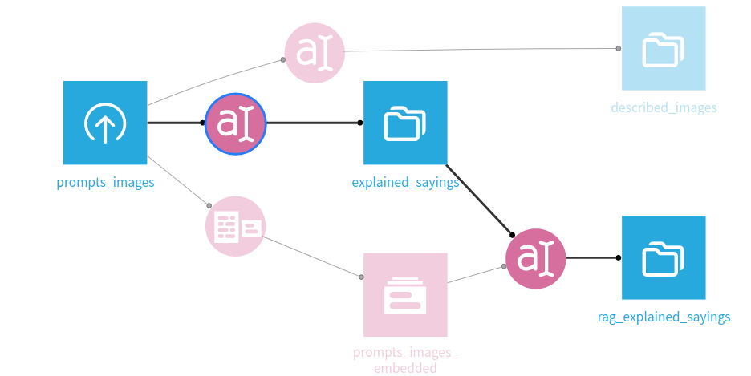

Setup another prompt recipe as before, this time picking the generative model of the Custom LLM
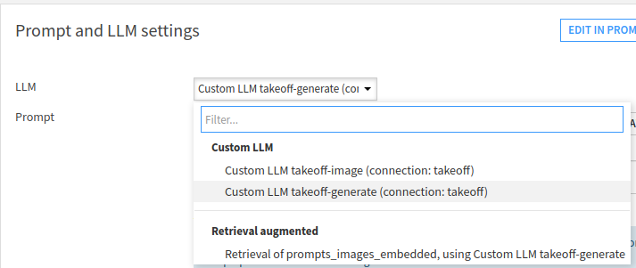
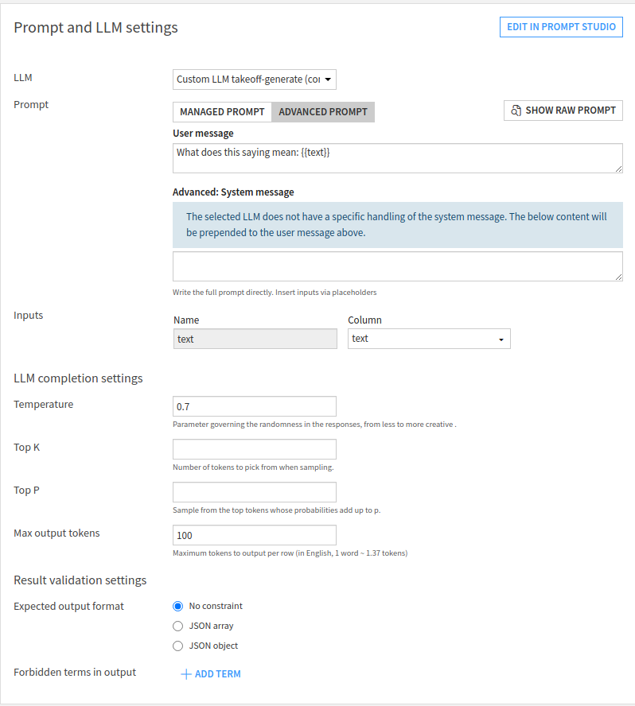

Running this should generate descriptions of the sayings:
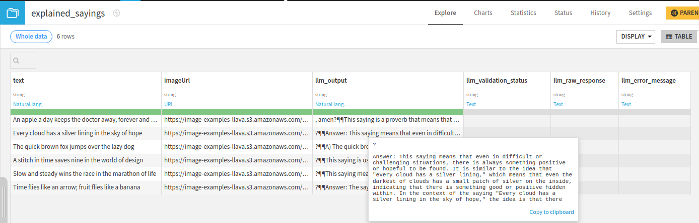
## Using these LLMs in a workflow: Embedding text
Next we'll embed each of the sayings into a vector database. 
The setup for the embedder also creates the vector database which needs its own code env,
which we'll setup first.

Go to the administrator section (see instructions above for setting up a connection), then select the `Code Envs` tab and press `New Python Env`.

Setup the environment to use a recent Python version available on your system (e.g. `3.10` on my system). 
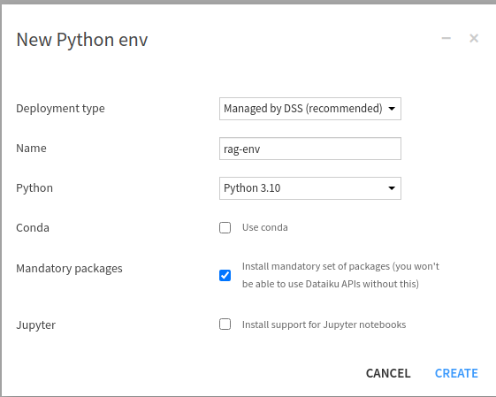

The custom code environment is needed to import the vector database we're going to use. After the env has been created, select `Packages to install` in the left-hand navigation bar.

As we're going to use the `FAISS` vector database via langchain, we'll need to request the following packages:
```text
langchain==0.1.0
faiss-cpu
pydantic==1.10.9
```
Select `save and update` after entering these to finish setting up your Code Env. If there's an issue with installing, you may have to play around with the selected versions (usually based on your version of Python).

Returning to your flow, we can now use an embed recipe to create the embedder.
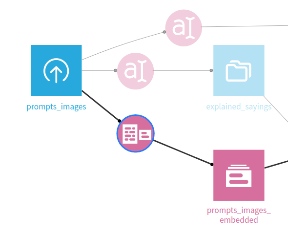

Note here that the Knowledge bank settings will need changing to use our newly setup code env.

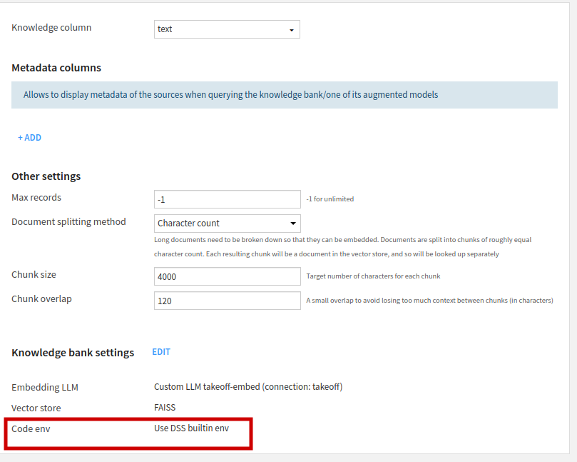

Select edit -> Core Settings and then `Select an environment` for Code Env and set it to the newly created environment (e.g. `rag-env` in this example).

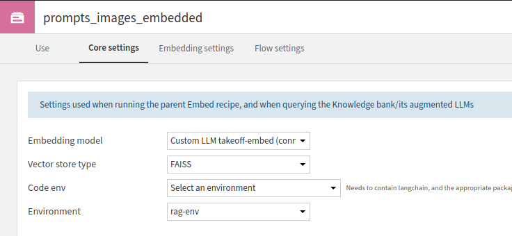

We'll also add RAG functionality to our LLM here; navigating back to the 'Use' page of the Knowledge bank settings, add an Augmented LLM which can make use of the embeddings in generating an output.

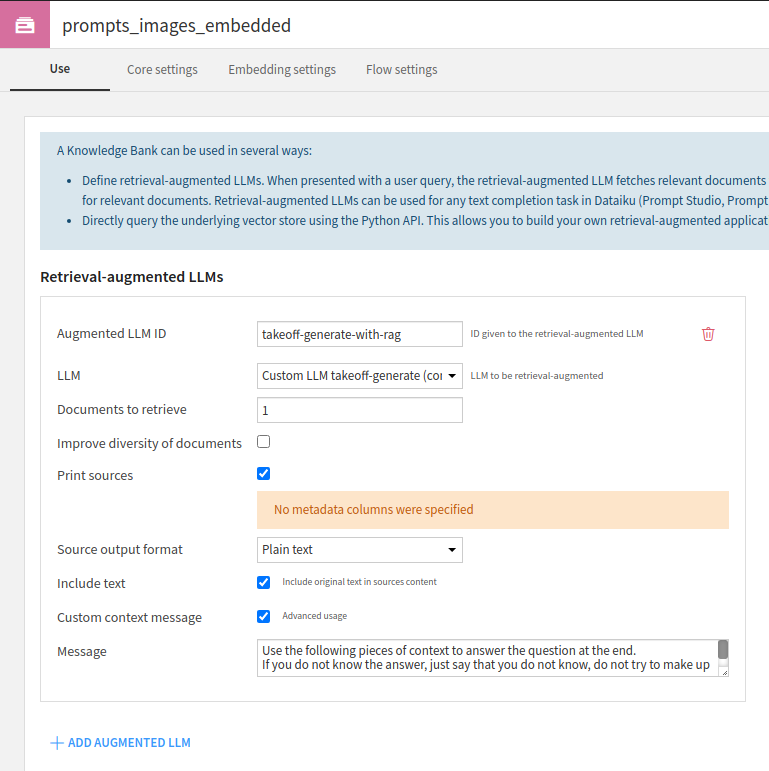

## Using these LLMs in a workflow: RAG workflows
After running the embedder, we can now use this Augmented LLM to create a Rag workflow. Create a `Prompt` recipe, and then select the Retrieval Augmented LLM we just created.


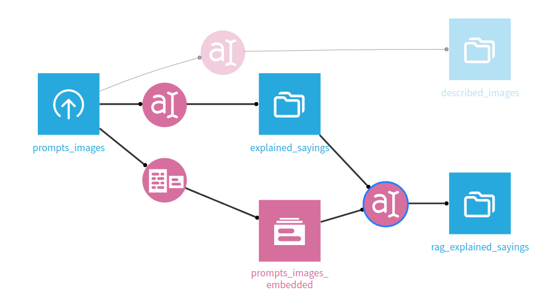

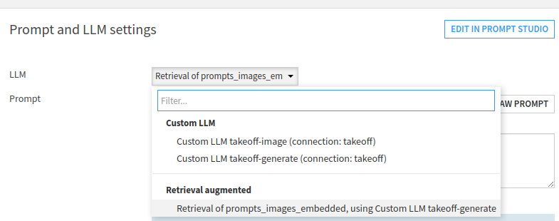

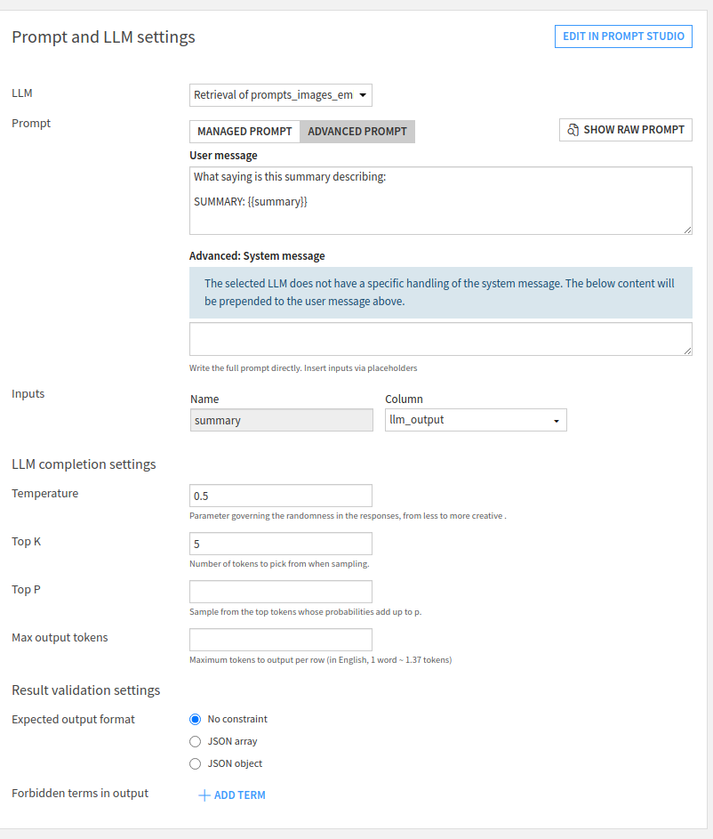


## Running the whole flow

You can now run the final generation recipe, and get as output what the model thinks each one was referring to, with some attempts at explaining why. Tweaking the models and parameters used will improve performance here, naturally.

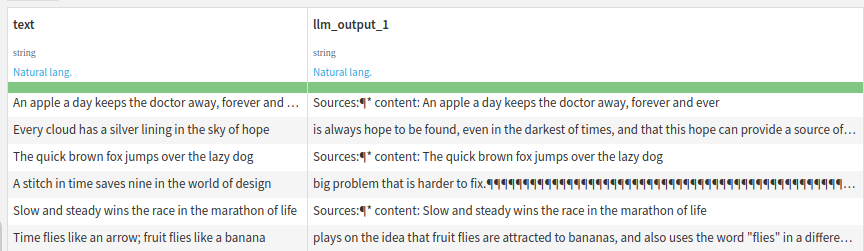


### Generating according to a JSON schema or Regex

Dataiku requires these be set at the connection level, with the schema or regex specified input for a given connection and then applied to every inference made with that model.

It's usually worth making two models, each serving as a generator but with one using the required json schema / regex and one which does not.

### Chat Templates

Our Dataiku plugin also supports the use of chat templates. To configure these, create a recipe with an Advanced Prompt which has a list of messages as the `User Message`, just as you would pass to the `inputs` field when using the [native chat template endpoint](https://docs.titanml.co/docs/Docs/interfacing/chat_template).

An example `User Message` would be:
```text
[
    {"role":"system", "content": "You are a helpful assistant whose job is to explain sayings"},
    {"role":"user", "content":"{{text_input_1}}"}
]


# Contributing

## Getting started

This section will assume you are using IntelliJ IDEA as a development
environment.

## Setting up IntelliJ for plugin development

To build the project, install the [ant](https://ant.apache.org/) Intellij
plugin (for more information on the plugin,
Then, in the bar on the right of the page (with an ant on it), click the
settings icon, and in the execution tab, in the "Ant Command Line" text
field, add:
see [here](https://www.jetbrains.com/help/idea/ant.html)).

```
 -Denv.DKUINSTALLDIR=<path/to/dataiku-dss-xx.x.x>
```

For example, on a Mac with the dataiku free edition:

```
DKUINSTALLDIR=/Users/fergusbarratt/Library/DataScienceStudio/kits/dataiku-dss
-12.5.1-osx/
```

Or on linux with a newer version:
```shell
DKUINSTALLDIR=/home/titan-m0/dataiku-dss-12.5.2
```

To give intellij access to the various Dataiku packages, navigate to the
IntelliJ Project Structure modal (`File->Project Structure`, or `CMD-;`). On
this
page
click the plus icon, and add the `/lib/`, `/dist` and `/lib/shadelib` folders
in the `DKUINSTALLDIR` above.
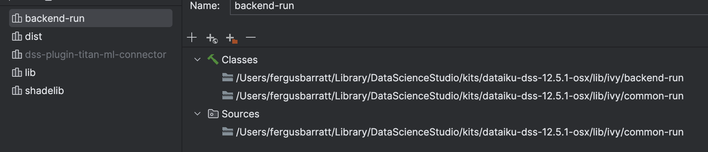

You'll also need to install `gson` from maven (Press + -> From Maven -> Search for gson). 
An example of what your .idea folder should now look like is available in example_idea.md.

This should be enough to get IntelliJ setup to develop the Dataiku plugin.
To build the package, in the ant sidebar, click the play icon with the `jar`
task highlighted.
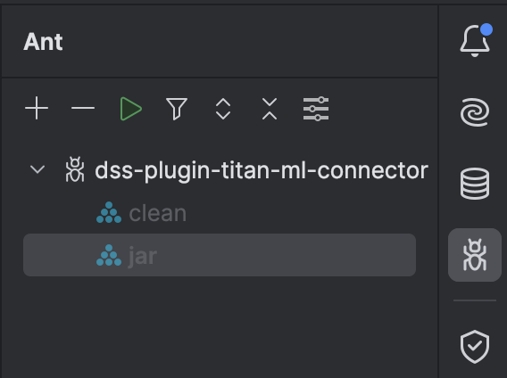
A compiler window should appear.

## Installing the plugin into Dataiku

To use the plugin in Dataiku, it should be installed as a plugin in the
Plugins page. If you develop it in the dataiku dev folder, for OSX that'll look something like:

```
/Users/fergusbarratt/Library/DataScienceStudio/dss_home/plugins/dev/titan-ml-connector
```

Or an example for linux:
```shell
/home/titan-0/takeoff-dataiku/titan-ml-connector

```

Alternatively, you can just make symlink from your development environment to the plugins/dev folder.

Then you can make it a development plugin. To make your changes available to
any workflows that use the plugin, you have to recompile the java binary
(with ant, see above),
and then click the reload all button on the dev plugins page.
