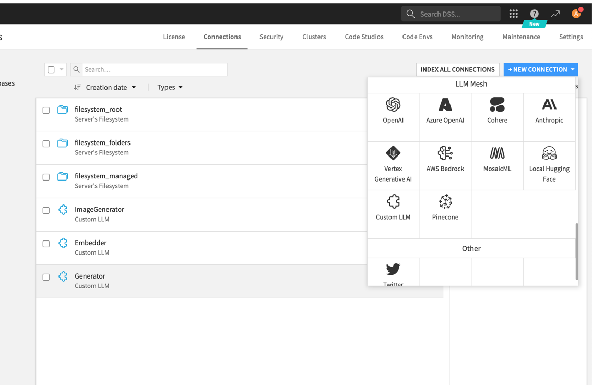
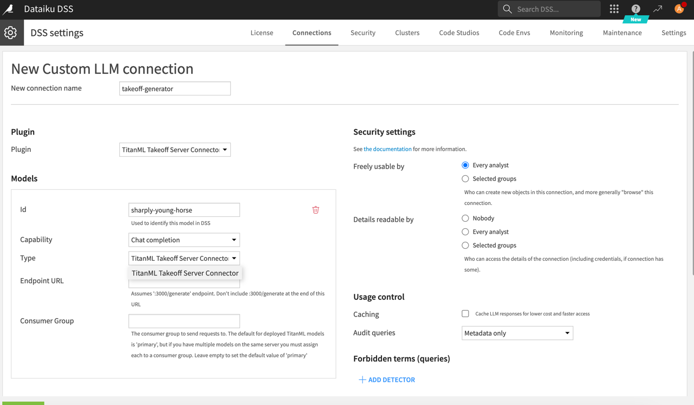
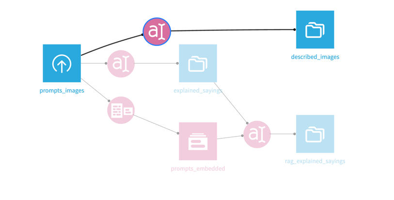
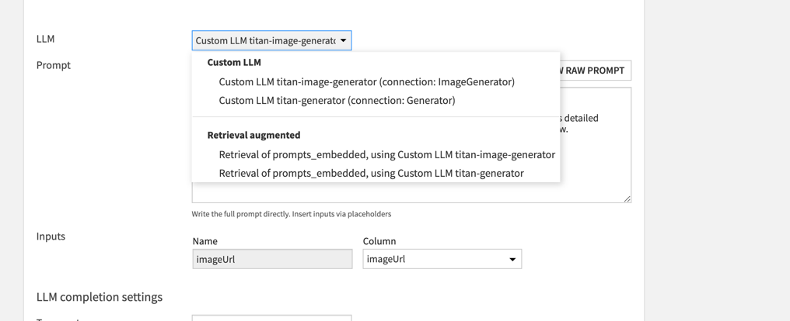

# Takeoff Dataiku Plugin

See a video demo of the plugin in action
[here](https://www.loom.com/share/9c24d2ed5ce94165b76834a068fafd66?sid=de7762cc-229e-4aa8-ad54-28476cb009ab)

## Example: using the Dataiku Takeoff plugin to describe images

In this example, we'll setup a simple workflow to demonstrate using takeoff
with dataiku to do some simple AI tasks.

## Importing a dataset

First, we need a dataset. Here's one ChatGPT made earlier:

```csv
text,imageUrl
"An apple a day keeps the doctor away, forever and ever", "https://image-examples-llava.s3.amazonaws.com/images/apple_day.png"
"Every cloud has a silver lining in the sky of hope", "https://image-examples-llava.s3.amazonaws.com/images/cloud_silver.png"
"The quick brown fox jumps over the lazy dog", "https://image-examples-llava.s3.amazonaws.com/images/fox_dog.png"
"A stitch in time saves nine in the world of design", "https://image-examples-llava.s3.amazonaws.com/images/needle_thread.png"
"Slow and steady wins the race in the marathon of life", "https://image-examples-llava.s3.amazonaws.com/images/slow_steady.png"
"Time flies like an arrow; fruit flies like a banana", "https://image-examples-llava.s3.amazonaws.com/images/time_banana.png"
```

Save it in a file called `data.csv`. Then, from the dropdown menu in dataiku,
upload the dataset:


## Setting up Takeoff

We've got a dataset in dataiku. Before we setup the dataiku plugin, we need
to setup the TitanML takeoff server to serve models and respond to requests.
We're going to use the
Takeoff [config](https://docs.titanml.co/docs/Docs/model_management/manifests)
file setup to deploy multiple
models at the same time, so we can explore all of the plugin's capabilities
at once.

Save the following as `config.yaml` in your working directory.

```yaml
takeoff:
  server_config:
    max_batch_size: 30
    batch_duration_millis: 50
    echo: false
    port: 3000
    enable_metrics: true
    heartbeat_check_interval: 5
    launch_management_server: true
    launch_vertex_server: false
    launch_sagemaker_server: false
    launch_openai_server: false
    management_port: 3001
    vertex_port: 3002
    openai_port: 3003
  readers_config:
    reader1:
      model_name: TitanML/llava-1.5-13b-hf-awq
      device: cuda
      consumer_group: image-generator
      max_seq_length: 512
      max_batch_size: 4
    reader2:
      model_name: TheBloke/Llama-2-7B-Chat-AWQ
      device: cuda
      max_seq_length: 512
      consumer_group: generator
      max_batch_size: 4
    reader3:
      model_name: "BAAI/bge-small-en"
      device: cuda
      consumer_group: embedder 
```

Then, after setting up your login for takeoff (described in detail
[here](https://docs.titanml.co/docs/Docs/launching/accessing_takeoff)),
run the following command to set your takeoff server running.

Note: you
should have at least 24GB of VRAM to run this configuration. If you receive
errors about going Out of Memory (OOM), try smaller models, or try deploying
the individual models one-by-one. For more information, see
[supported models](https://docs.titanml.co/docs/Docs/launching/supported_models).
For more information on using AWS to spin up instances with sufficient VRAM,
see [here](https://docs.titanml.co/docs/Docs/integrations/aws).

```bash
docker run --gpus all \
    -p 3000:3000 \
    -p 3001:3001 \
    -v ~/.model_cache:/code/models \
    -v ./config.yaml:/code/config.yaml \
    tytn/takeoff-pro:0.12.0-gpu
```

That container should boot up, running all three models in tandem.

## Using the plugin in a Dataiku workflow

To use the plugin in Dataiku, you must first have the administrator enable
the LLM that the plugin provides. To do this as an administrator, go to the
`Administrator` page in the dropdown on the top right, and then go to the
connections page. Then add a `Custom LLM` connection.



In the configuration
page, make sure to set the endpoint URL for the deployed takeoff instance,
and to choose your plugin as the type.



The dataiku platform treats each model deployed in the Takeoff server as a
separate Custom LLM connection. So to get this setup going, we need to setup
3 Custom LLM connections, one for the embedding model, one for the
generation model, and one for the image generation model. The different
models are identified inside takeoff by
their [consumer_group](https://docs.titanml.co/docs/Docs/model_management/readers):
internally,
takeoff will route all requests with a given `consumer_group` to the
model that was deployed with that key.

It's that `consumer_group` key that we need to enter here. So, to setup the
image generation model, enter `image-generator` (the consumer group from the
takeoff config above) into the configuration page. Make sure the endpoint
URL is set correctly, to a accessible URL from which the dataiku
instance can reach your deployed models.

Proceed to setup the `generator` and `embedder` models similarly. For the
embedding model, the `Capability` field should instead be set to `Text
embedding`.

Once you've finished this section - you should have setup 3 dataiku models for
use inside your Dataiku flows. On the takeoff side, you've deployed these
three language models on the same machine, such that dataiku can address
them all individually.

## Using these LLMs in a workflow: Image to Text

Coming back to our dataset: we're going to build 3 LLM workflows that
transform that dataset. First, image to text:

To transform the images in our dataset using the takeoff connection, start
by adding a new LLM 'Prompt' Recipe. This can be found in the sidebar:

This icon:


Inside the setup, choose the image generation LLM from the dropdown, and
then choose the "Advanced Prompt" option. Add an image tag to the start of
the prompt: the image tag should be formatted as `<image:{{imageUrl}}>`,
where `{{imageUrl}}` is a placeholder for the actual URL pointing to the
image. The rest of the prompt is a description of the task you'd like the
model to perform, including any extra system prompt information you'd like
to feed to the model.


::: Note

Image to text is supported only for remote urls (in dataiku) for the moment. A
text field
in your input should contain a URL pointing to an image to which your takeoff
instance has access - for
example: `https://fastly.picsum.photos/id/622/200/300.jpg?hmac=HR8-4uUEihkyJx4VczHLFhVvELy7KCD1jm16BABaDy8`

## Back to the dashboard

Click the run button on the LLM connection you've just built. It should
begin to create image descriptions of each of the images in your dataset.

:::

# Contributing

## Getting started

This section will assume you are using IntelliJ IDEA as a development
environment.

## Setting up IntelliJ for plugin development

To build the project, install the [ant](https://ant.apache.org/) Intellij
plugin (for more information on the plugin,
Then, in the bar on the right of the page (with an ant on it), click the
settings icon, and in the execution tab, in the "Ant Command Line" text
field, add:
see [here](https://www.jetbrains.com/help/idea/ant.html)).

```
-Denv.DKUINSTALLDIR=/path/to/dataiku/kit
```

(on the ant command line, this can be specified as an environment variable.
`DKUINSTALLDIR=/path/to/dataiku/kit ant ...`)

For example, on my Mac with the dataiku free edition:

```
DKUINSTALLDIR=/Users/fergusbarratt/Library/DataScienceStudio/kits/dataiku-dss
-12.5.1-osx/
```

To give intellij access to the various Dataiku packages, navigate to the
IntelliJ Project Structure modal (`File->Project Structure`, or `CMD-;`). On
this
page
click the plus icon, and add the folders under the `/lib/` and `/dist` paths
in the `DKUINSTALLDIR` above.


This should be enough to get IntelliJ setup to develop the Dataiku plugin.
To build the package, in the ant sidebar, click the play icon with the `jar`
task highlighted.

A compiler window should appear.

## Installing the plugin into Dataiku

To use the plugin in Dataiku, it should be installed as a plugin in the
Plugins page. If you develop it in the dataiku dev folder, for me here:

```
/Users/fergusbarratt/Library/DataScienceStudio/dss_home/plugins/dev/titan-ml-connector
```

Then you can make it a development plugin. To make your changes available to
any workflows that use the plugin, you have to recompile the java binary
(with ant, see above),
and then click the reload all button on the dev plugins page.
